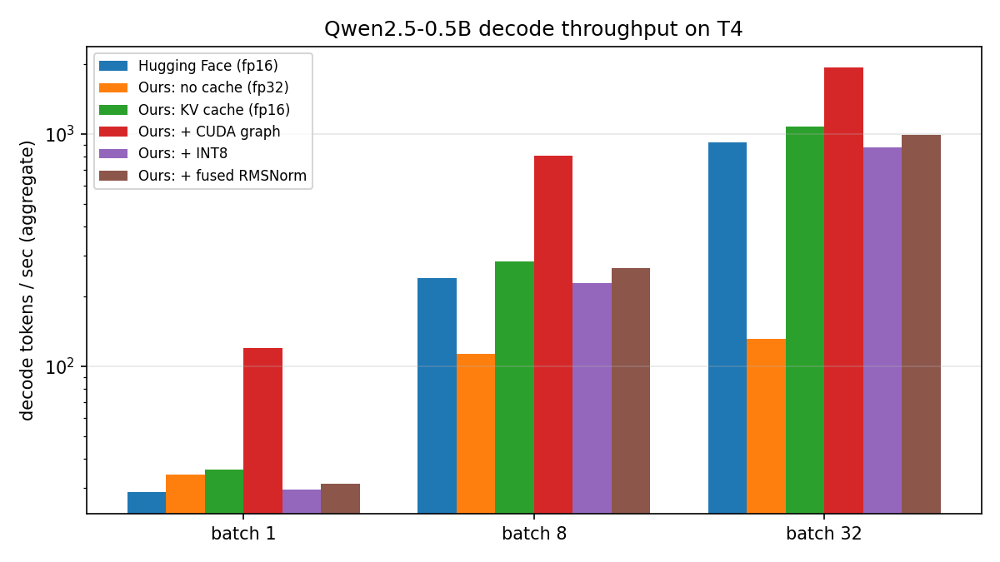

# llm-engine

A from-scratch inference engine for Qwen2.5-0.5B-Instruct, built to measure where decode time goes and how far each optimization moves it.

## The problem

Generating one token requires reading every weight in the model from GPU memory (~1 GB in fp16 for this model). On a T4 (320 GB/s) that is ~3 ms per token from bandwidth alone, while the arithmetic takes ~15 µs. Decode is **memory-bandwidth-bound**: the GPU's compute units idle >95% of the time waiting on weights. Every optimization here either reads fewer bytes per token or produces more tokens per read.

## What's here

| Step | What | Where |
|---|---|---|
| Forward pass | Embedding, RMSNorm, RoPE, grouped-query attention, SwiGLU MLP, 24 layers, tied unembedding — written by hand, verified against Hugging Face to <1e-2 logit error | `engine/model.py` |
| KV cache | Preallocated per-layer K/V buffers written in place; `prefill` + `decode` split. Turns generation from quadratic to linear | `engine/model.py` (`KVCache`) |
| Batching | Left-padded batches with attention masks and per-row positions; one weight read serves N sequences | `engine/model.py` (`prefill`/`decode`) |
| INT8 | Weight-only, per-output-row scale, dequantized on the fly. Halves weight bytes | `engine/quant.py` |
| CUDA graphs | Whole decode step captured once and replayed as a single launch; static token/position/mask buffers, `index_copy_` cache writes at a device-side position | `engine/graph.py` |
| Fused RMSNorm | One CUDA kernel (warp-shuffle reduction) replacing three PyTorch ops: one HBM read + one write instead of three | `csrc/rmsnorm.cu`, `engine/kernels.py` |
| Benchmarks | Decode tok/s per configuration × batch size, median of N runs | `bench/bench.py` |
| Perplexity | WikiText-2, fp16 vs INT8, same windows | `bench/ppl.py` |
| Tests | Logits vs HF, cached == uncached == HF greedy, batched == single, INT8 sanity, kernel vs PyTorch | `tests/test_engine.py` |

## Results (T4, Qwen2.5-0.5B-Instruct, 128 decode tokens, median of 3)



Decode throughput, tokens/sec (aggregate across the batch):

| Configuration | batch 1 | batch 8 | batch 32 |
|---|---|---|---|
| Hugging Face `generate`, fp16 | 29.5 | 223 | 900 |
| Ours, no cache, fp32 (32 tokens) | 42.9 | 115 | 133 |
| Ours, KV cache, fp16 | 36.5 | 276 | **1107** |
| Ours + INT8 weight-only | 28.4 | 220 | 913 |
| Ours + fused RMSNorm kernel | 34.8 | 271 | 1063 |
| vLLM, fp16 | — | — | 3690 |

Quantization accuracy (WikiText-2 test, 40 × 512-token windows):

| Precision | Perplexity | Weight size |
|---|---|---|
| fp16 | 18.07 | 988 MB |
| INT8 (per-row, weight-only) | 17.99 | 631 MB |

Correctness: logits match Hugging Face to 7.5e-5 max abs error; cached greedy == uncached greedy == HF greedy (with HF's default `repetition_penalty=1.1` disabled); batched left-padded output == per-prompt output.

## What the numbers say

**The KV cache is the whole game.** Without it, throughput at batch 32 is 133 tok/s and falls with sequence length; with it, 1107. That is the quadratic-to-linear fix.

**Batching is where the bandwidth argument shows up.** Batch 1 → 32 is a 30× throughput gain for the same weight reads. At batch 1 every configuration lands near 30–40 tok/s regardless of precision, because a 24-layer decode step is ~300 small kernel launches and Python overhead dominates, not memory. The T4's 320 GB/s would allow ~300 tok/s; we get a tenth of that at batch 1.

**INT8 weight-only was a net loss on this hardware.** Weights shrank 988 → 631 MB and perplexity did not move (18.07 → 17.99, inside noise), but throughput dropped 17%. Dequantizing `int8 → fp16` on the fly in PyTorch is an extra full pass over every weight matrix per step, which costs more than the bandwidth it saves. The saving only materializes with a fused dequant-GEMM kernel that reads int8 and multiplies in one pass (what TensorRT-LLM and vLLM's quantized paths do).

**The fused RMSNorm kernel is within noise.** It compiles, matches PyTorch to 1e-3, and replaces three launches with one, but RMSNorm is under 2% of a decode step for a 896-wide model. The lesson: profile before optimizing. The next kernel worth writing is the attention or the dequant-GEMM, not the norm.

**vLLM is 3.3× faster at batch 32.** The gap is CUDA graphs (the whole decode step captured once and replayed with no Python launch overhead), paged KV memory, and fused attention kernels. Those three are the obvious next steps.

## Run

```
pip install torch transformers safetensors datasets matplotlib
python -m tests.test_engine --tiny      # architecture check, no download
python -m tests.test_engine             # vs Qwen2.5-0.5B-Instruct
python -m bench.bench                   # throughput → bench/results.csv
python -m bench.ppl                     # perplexity → bench/ppl.csv
python -m bench.plot                    # chart + resume numbers
```

Or open `run_all.ipynb` in Colab with a T4 runtime and Run all.
